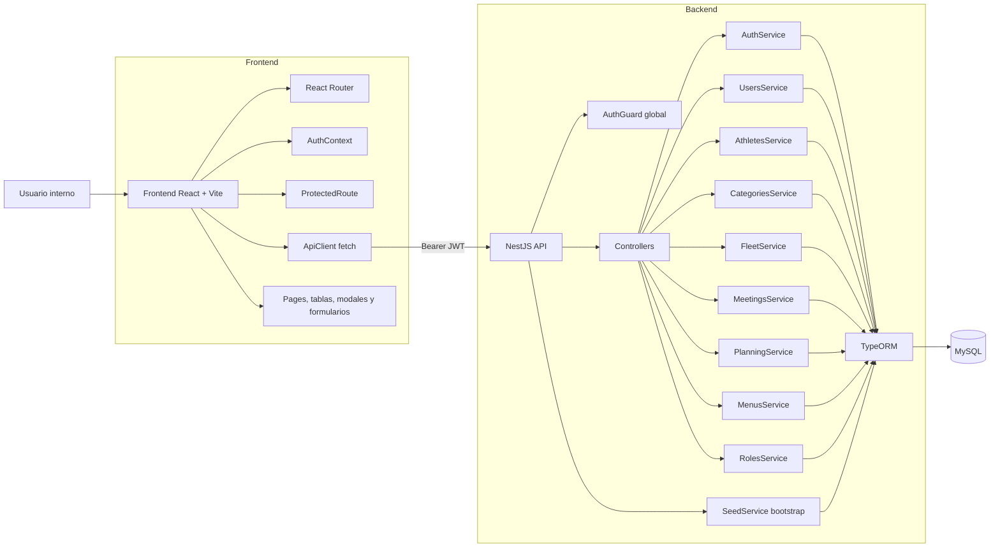

# Arquitectura y funcionamiento actual

Este documento resume la arquitectura real actual del sistema y como fluyen frontend, backend y base de datos.

## Diagrama de arquitectura

## Funcionamiento actual

### 1. Autenticacion y sesion

- El usuario ingresa con RUT y clave desde `/login`.
- El backend valida `clave_hash`, roles y genera JWT.
- El frontend guarda token y reconstruye sesion con `GET /auth/me`.
- Toda la aplicacion queda protegida salvo el login.

### 2. Usuarios y acceso

- El sistema distingue entre persona registrada y usuario con acceso.
- Crear usuario puede dejar a la persona sin acceso.
- Habilitar acceso es un flujo independiente.
- Un usuario con acceso debe tener al menos un rol.
- Un usuario sin acceso puede existir sin roles.
- El login rechaza usuarios sin clave o sin roles efectivos.

### 3. Modulo deportivo

- El modulo trabaja sobre usuarios ya existentes.
- `searchUsers` permite buscar usuarios por nombre o RUT.
- `create` registra deportista sobre usuario existente.
- `findActive` lista deportistas activos con categoria vigente.
- `changeCategory` cierra categoria vigente y crea nueva fila historica.
- La grilla de deportistas usa busqueda por nombre, RUT y categoria, mas paginacion.

### 4. Modulo de flota

- La gestion de flota vive en una sola pantalla `/flota`.
- La pantalla carga catalogos de tipo y estado desde `GET /fleet/catalogs`.
- La grilla usa busqueda inteligente y filtros.
- El alta, edicion y detalle se resuelven con modales.
- El backend valida:
  - tipo de bote existente y activo
  - estado de bote existente y activo
  - nombre unico para el bote
- El seed deja listos los catalogos, pero no crea botes demo.

### 5. Reuniones y actas

- El formulario de reuniones valida fecha, horas, lugar y participantes.
- El acta se maneja dentro del mismo flujo de la reunion.
- Si se adjunta archivo, se guarda en base64 dentro de la base.
- El backend resuelve automaticamente actor y rol principal del acta.

### 6. Planificacion anual

- El plan contiene areas.
- Cada area contiene items.
- Cada item puede tener responsable.
- Cada item puede registrar seguimientos.
- El backend recompone resumen de cumplimiento al consultar el plan.

## Modulos backend vigentes

- `auth`
- `users`
- `athletes`
- `categories`
- `fleet`
- `meetings`
- `planning`
- `roles`
- `menus`
- `seed`
- `health`

## Navegacion actual

El frontend hoy expone estas areas:

- Inicio
- Usuarios
- Deportistas
- Flota
- Reuniones
- Planificacion
- Mi acceso

Rutas activas:

- `/login`
- `/`
- `/mi-acceso`
- `/usuarios`
- `/usuarios/nuevo`
- `/usuarios/:id/editar`
- `/usuarios/:id/habilitar-acceso`
- `/deportistas`
- `/deportistas/nuevo`
- `/deportistas/:id`
- `/flota`
- `/reuniones`
- `/reuniones/nueva`
- `/reuniones/:id`
- `/reuniones/:id/editar`
- `/planificacion`
- `/planificacion/nuevo`
- `/planificacion/:id`
- `/planificacion/:id/editar`

## Capas y responsabilidades

### Frontend

- `pages`: resuelven vistas y flujos de modulo.
- `services`: concentran llamadas HTTP.
- `types`: describen payloads y respuestas.
- `components`: reutilizan layout, tablas, modales y mensajes.
- `layouts`: contienen la estructura protegida de la app.

### Backend

- `controllers`: exponen rutas HTTP.
- `services`: concentran reglas de negocio.
- `entities`: definen el modelo persistente real.
- `seed`: prepara catalogos y datos demo para desarrollo.

## Persistencia

- TypeORM trabaja con `autoLoadEntities: true`.
- En desarrollo se usa `synchronize: true`.
- No hay migraciones versionadas en el repositorio.
- La semilla automatica es parte importante del entorno de desarrollo.

## Decisiones tecnicas que afectan flujos

### Usuario sin acceso

No existe una tabla separada para "acceso". El acceso depende de:

- `usuario.clave_hash`
- existencia de filas en `usuario_rol`

Por eso los flujos de crear usuario y habilitar acceso se resuelven sobre la misma entidad.

### Deportistas con historial

La categoria vigente no vive como columna directa en `deportista`. Se reconstruye desde `deportista_categoria` usando `vigente = true`.

Consecuencia:

- hay trazabilidad historica real
- cambiar categoria implica cerrar la fila vigente y crear otra

### Flota parametrizada

`bote` no guarda textos libres para tipo y estado. Usa relaciones a catalogos:

- `tipo_bote`
- `estado_bote`

Consecuencia:

- filtros y grillas consistentes
- validaciones mas simples
- base lista para evolucionar a asignacion de botes o regatas

## Hallazgos tecnicos vigentes

- El sistema ya tiene autenticacion, pero no autorizacion por rol a nivel de endpoint.
- `menu_rol` existe en el modelo, pero `MenusService` devuelve menus autenticados sin filtro efectivo por rol.
- El seed es parte del comportamiento operativo del backend en desarrollo.
- `docs/database.sql` no representa el esquema funcional completo.
