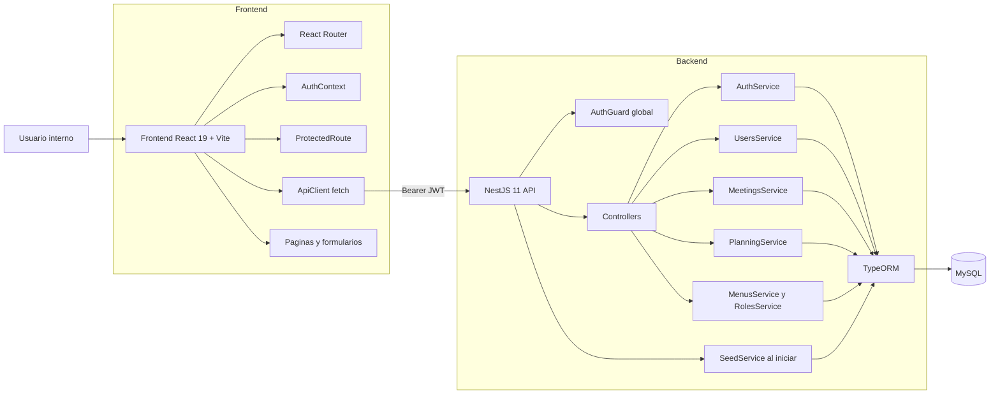
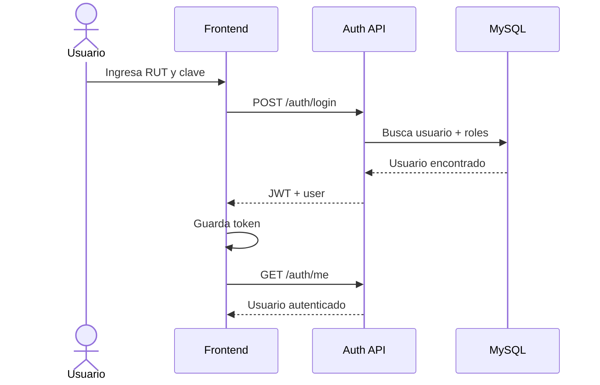

# Arquitectura y funcionamiento actual

Este documento resume la arquitectura actual del sistema y el flujo real entre frontend, backend y base de datos.

## Diagrama de arquitectura

## Como funciona hoy

### 1. Autenticacion y sesion

- El usuario inicia sesion con RUT y clave desde `/login`.
- El backend valida credenciales, carga roles del usuario y genera un JWT.
- El frontend guarda el token y lo reutiliza en cada request mediante `Authorization: Bearer`.
- `ProtectedRoute` bloquea la aplicacion si no hay sesion valida.
- Al recargar, `AuthContext` intenta reconstruir la sesion consultando `GET /auth/me`.

## Flujo de sesion

### 2. Backend por modulos

- `auth`: login, perfil autenticado y cambio de clave.
- `users`: CRUD de usuarios y asignacion de roles.
- `meetings`: CRUD de reuniones, participantes y acta asociada.
- `planning`: CRUD de planes anuales, areas, items y seguimientos.
- `roles`: catalogo de roles.
- `menus`: catalogo de menus e items de navegacion.
- `seed`: carga catalogos y datos demo al iniciar la aplicacion.
- `health`: endpoint de verificacion simple.

### 3. Persistencia

- TypeORM usa `autoLoadEntities: true`.
- En desarrollo se usa `synchronize: true`, por lo que el esquema se crea o ajusta desde las entidades.
- No hay migraciones versionadas dentro del repo.
- La base contiene tanto catalogos como datos operacionales y datos demo.

### 4. Navegacion y autorizacion actual

- Toda la API queda protegida por `AuthGuard`, salvo endpoints publicos.
- El token incluye `sub`, `rut` y `roles`.
- Hoy no existe una capa RBAC por endpoint basada en esos roles.
- El frontend consume `/menus` para poblar el sidebar.
- Aunque existe `menu_rol` en el modelo, hoy `MenusService` devuelve menus autenticados sin filtrar por roles del usuario.

## Componentes funcionales principales

### Gestion de usuarios

- Crea usuarios con clave provisoria desde configuracion.
- Mantiene relacion muchos a muchos con roles.
- Evita duplicar RUT.
- Evita eliminar usuarios con actas registradas.
- Evita eliminar al ultimo usuario con rol `admin`.

### Gestion de reuniones y actas

- Una reunion puede registrar muchos participantes.
- El acta se crea o actualiza dentro del mismo flujo de la reunion.
- El sistema registra automaticamente quien actualizo el acta, su rol principal y la fecha.
- El archivo adjunto se almacena en base64 dentro de la base.

### Gestion de planificacion anual

- Un plan anual tiene areas, items y seguimientos.
- Cada item puede tener responsable y fecha planificada.
- Cada seguimiento actualiza trazabilidad y estado del item.
- El backend calcula resumen de cumplimiento y atrasos al consultar el plan.

## Hallazgos tecnicos relevantes

- La documentacion SQL no representa el esquema completo actual.
- El control de acceso es autenticado, pero no aun autorizado por rol a nivel de endpoint o menu.
- La semilla automatica es parte importante del entorno de desarrollo porque deja el sistema listo para pruebas funcionales.
