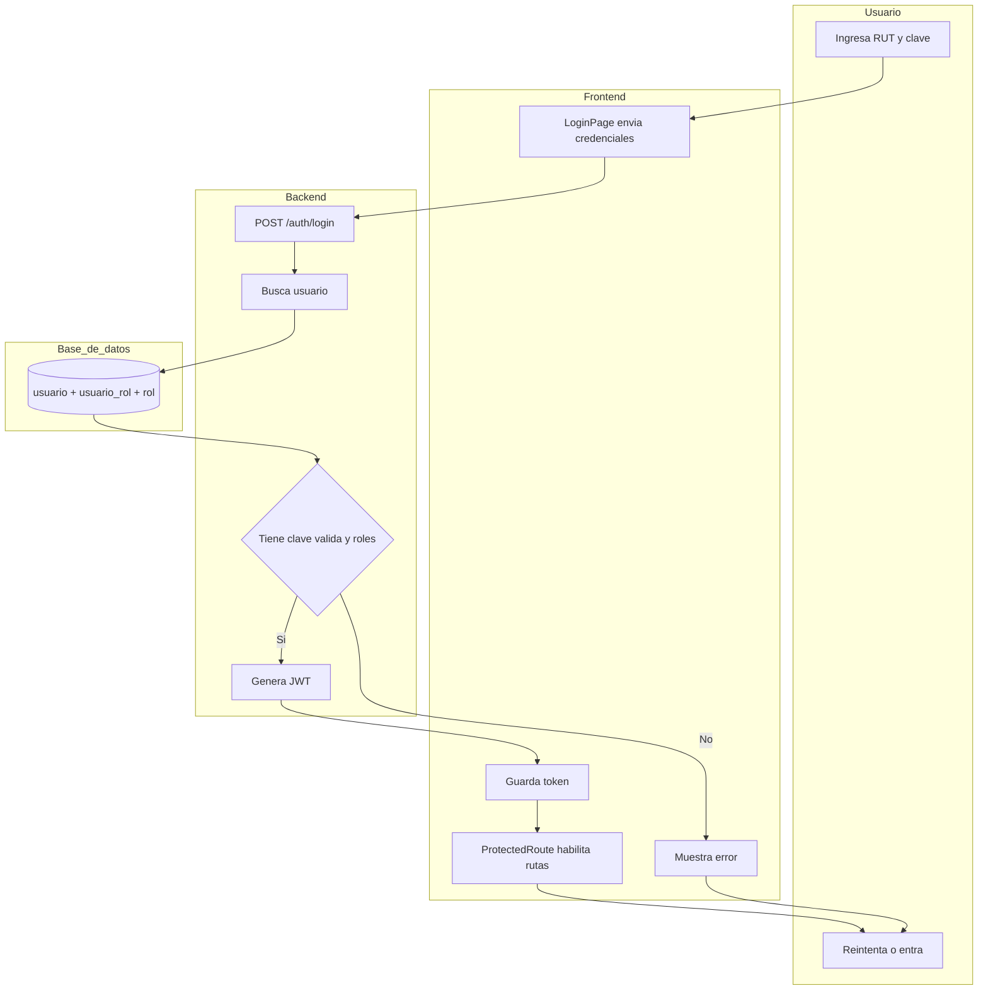
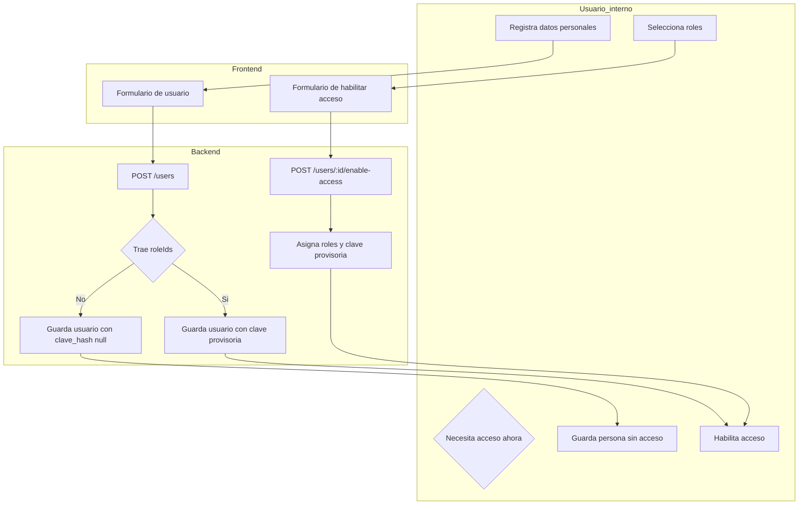
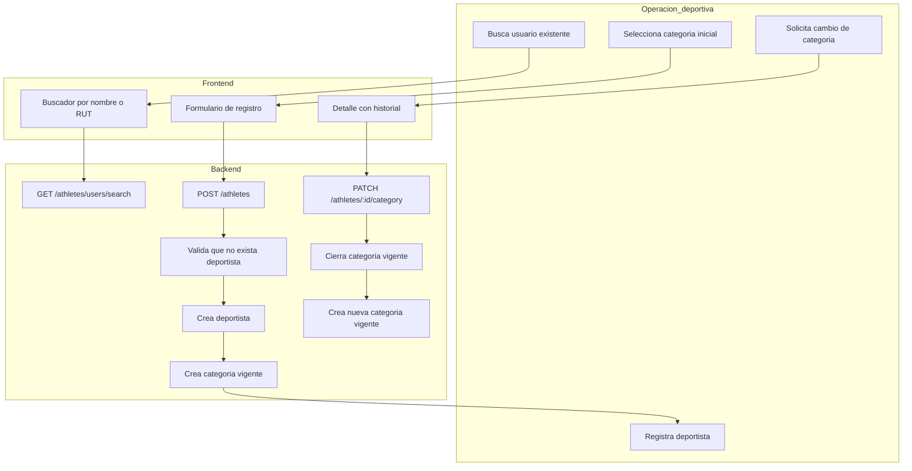
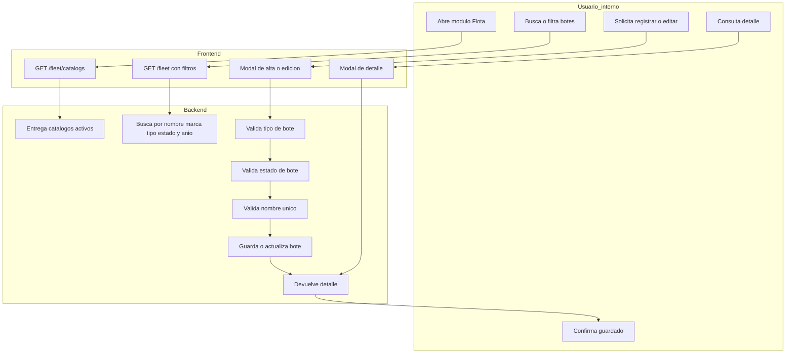
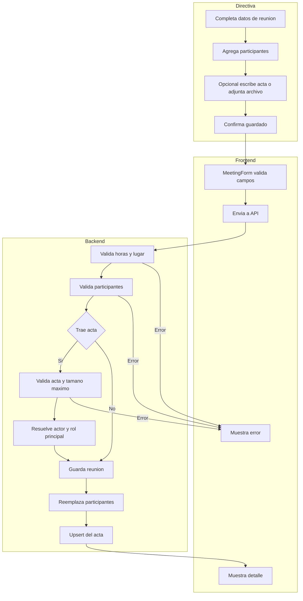
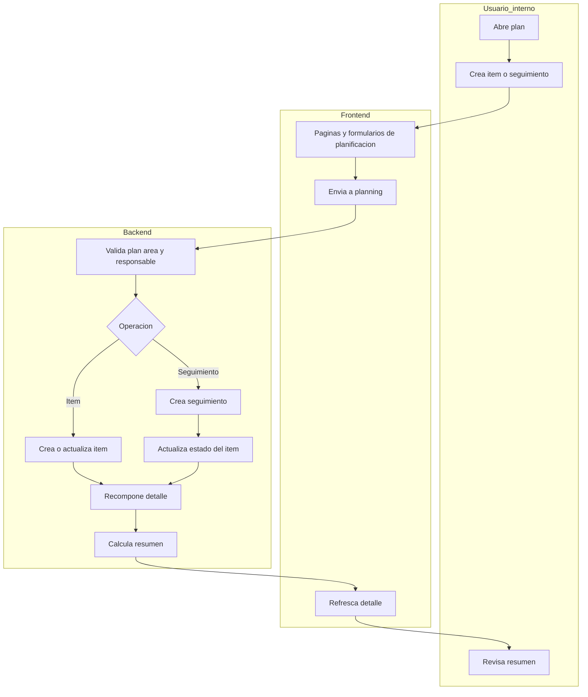

# Procesos clave

Mermaid no soporta BPMN completo en este repositorio, asi que este documento deja una version simplificada de los procesos funcionales mas importantes hoy.

## 1. Login y acceso protegido

## 2. Crear usuario sin acceso o habilitar acceso

## 3. Registrar deportista y cambiar categoria

## 4. Gestionar flota del club

## 5. Crear o actualizar reunion con acta

## 6. Gestion de plan anual

## Lectura rapida de impacto por modelo

- `usuario` y `usuario_rol` sostienen login y habilitacion de acceso.
- `deportista` y `deportista_categoria` sostienen historial y categoria vigente.
- `tipo_bote`, `estado_bote` y `bote` sostienen la gestion de flota.
- `reunion`, `participante_reunion` y `acta` sostienen la trazabilidad de reuniones.
- `plan_item` y `plan_seguimiento` sostienen el seguimiento operativo del plan anual.
