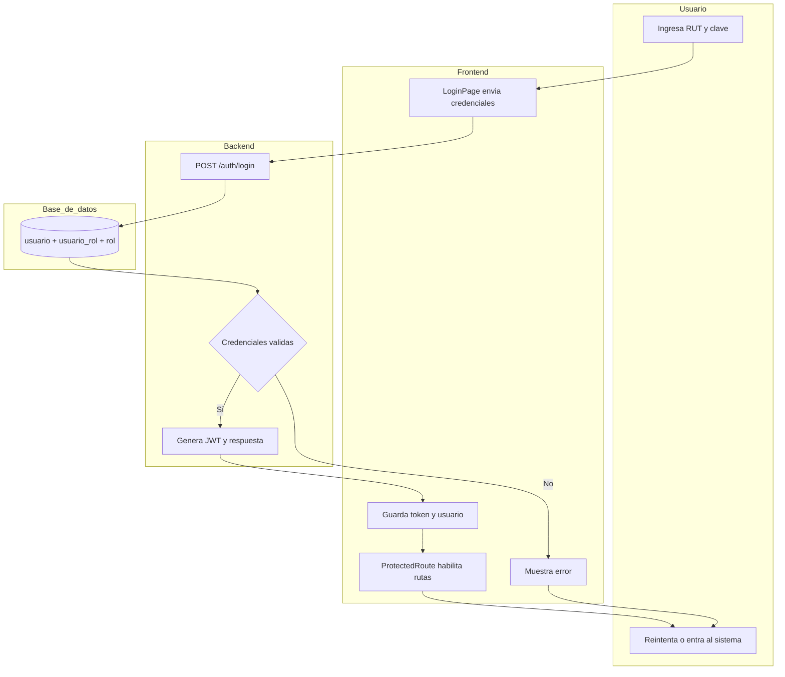
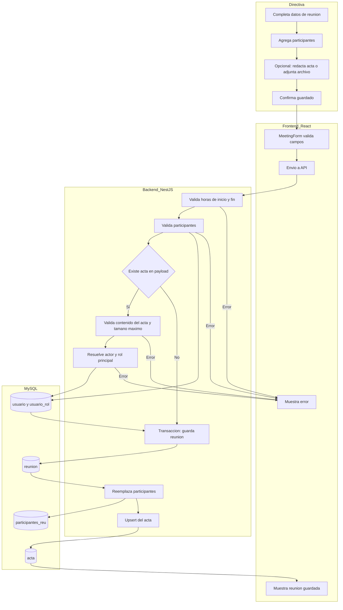
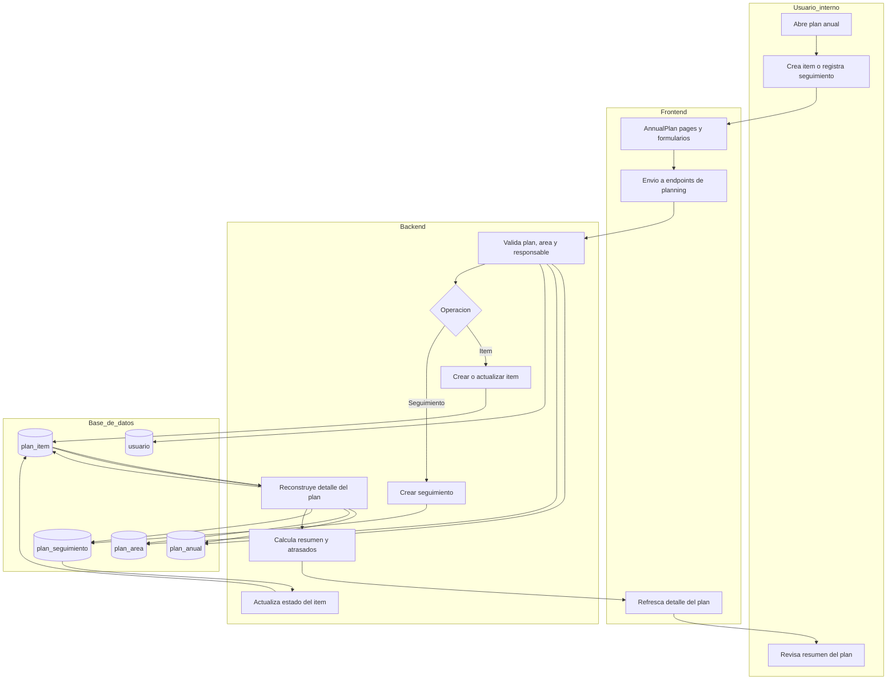

# BPMN simplificado de procesos clave

Mermaid no soporta BPMN nativo completo en este repositorio, asi que este documento deja un BPMN simplificado usando carriles y decisiones. La idea es reflejar el proceso real que hoy ejecuta el sistema.

## 1. Inicio de sesion y acceso protegido

## 2. Crear o actualizar reunion con acta

## 3. Seguimiento de plan anual

## Lectura rapida

- La autenticacion esta resuelta de extremo a extremo.
- Los procesos mas completos hoy son reuniones con acta y planificacion anual con seguimiento.
- Las reglas de negocio principales viven en los servicios del backend, no en procedimientos de base de datos.
