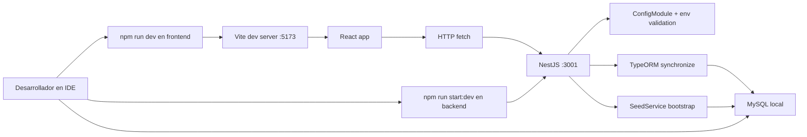
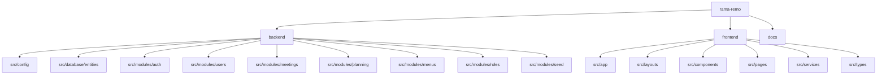

# Diagrama de desarrollo actual

Este documento muestra como esta organizado hoy el desarrollo del sistema, que piezas existen y que consideraciones tecnicas conviene tener presentes.

## Topologia de desarrollo local

## Mapa actual del repositorio

## Estado funcional actual

- Implementado: autenticacion con JWT y sesion persistida en frontend.
- Implementado: CRUD de usuarios con asignacion multiple de roles.
- Implementado: CRUD de reuniones con participantes y acta integrada.
- Implementado: CRUD de plan anual con areas, items y seguimientos.
- Implementado: catalogos base, menus e informacion demo mediante seed al arranque.
- Implementado: interfaz React protegida para operacion interna.

## Decisiones tecnicas vigentes

- Backend monolitico modular en NestJS.
- Frontend SPA en React con React Router.
- Persistencia relacional en MySQL.
- ORM con TypeORM y sincronizacion automatica en desarrollo.
- Seed automatico como parte del bootstrap de la aplicacion.
- Almacenamiento de archivos de acta dentro de la base en formato base64.

## Brechas o consideraciones del estado actual

- `docs/database.sql` no documenta el esquema real; solo crea la base.
- No hay migraciones versionadas ni estrategia formal de evolucion de esquema.
- El modelo tiene `menu_rol`, pero la navegacion no se filtra aun por roles en tiempo de consulta.
- La autenticacion existe, pero no hay autorizacion por rol a nivel de endpoint.
- Al guardar archivos de acta en base, el crecimiento de la tabla `acta` puede volverse relevante con el tiempo.

## Recomendaciones para la siguiente iteracion

- Generar migraciones o un SQL exportado desde el esquema real.
- Aplicar filtro efectivo de menus y permisos por rol.
- Separar archivos adjuntos de acta hacia almacenamiento externo o al menos binario fuera de `base64`.
- Incorporar diagramas como parte del README principal o de una wiki tecnica si este material va a crecer.
