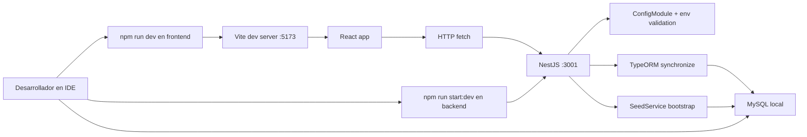

# Desarrollo actual

Este documento muestra como esta organizado hoy el desarrollo del sistema y que componentes existen realmente en la rama actual.

## Topologia de desarrollo local

## Mapa actual del repositorio

```mermaid
flowchart TD
    ROOT[rama-remo]
    ROOT --> BACKEND[backend]
    ROOT --> FRONTEND[frontend]
    ROOT --> DOCS[docs]

    BACKEND --> B1[src/config]
    BACKEND --> B2[src/database/entities]
    BACKEND --> B3[src/modules/auth]
    BACKEND --> B4[src/modules/users]
    BACKEND --> B5[src/modules/athletes]
    BACKEND --> B6[src/modules/categories]
    BACKEND --> B7[src/modules/fleet]
    BACKEND --> B8[src/modules/meetings]
    BACKEND --> B9[src/modules/planning]
    BACKEND --> B10[src/modules/menus]
    BACKEND --> B11[src/modules/roles]
    BACKEND --> B12[src/modules/seed]
    BACKEND --> B13[src/modules/health]

    FRONTEND --> F1[src/app]
    FRONTEND --> F2[src/layouts]
    FRONTEND --> F3[src/components]
    FRONTEND --> F4[src/pages]
    FRONTEND --> F5[src/services]
    FRONTEND --> F6[src/types]
    FRONTEND --> F7[src/utils]
```

## Estado funcional actual

- Implementado: autenticacion con JWT y sesion persistida.
- Implementado: usuarios con y sin acceso.
- Implementado: habilitacion de acceso con clave provisoria.
- Implementado: modulo de deportistas con historial de categorias.
- Implementado: busqueda y paginacion en listado de deportistas.
- Implementado: modulo de flota con catalogos, filtros, paginacion y modales de gestion.
- Implementado: modulo de competencias con pruebas, inscripcion del club, filtros operativos y validaciones deportivas.
- Implementado: reuniones con participantes y acta integrada.
- Implementado: planificacion anual con areas, items y seguimientos.
- Implementado: catalogos base, menus y datos demo mediante seed.

## Estado del seed de desarrollo

- 9 roles base.
- Catalogo de categorias deportivas.
- Catalogo completo de tipos de bote.
- Catalogo de estados de bote.
- Menus base de Inicio, Usuarios, Deportistas, Flota, Reuniones y Planificacion.
- 6 usuarios demo con acceso.
- 100 personas del club.
- Esas 100 personas registradas como deportistas.
- 30 deportistas Master.
- No se crean botes demo.
- 2 reuniones demo.
- 1 acta demo.
- 1 plan anual demo.

## Estado actual por modulo

### Usuarios

- Lista, alta, edicion y eliminacion.
- Flujo separado para habilitar acceso.
- Regla vigente: update comun no habilita acceso si el usuario aun no lo tiene.

### Deportistas

- Registro sobre usuario existente.
- Historial de categorias.
- Cambio de categoria con cierre de vigente anterior.
- Grilla con buscador por nombre, RUT y categoria.

### Flota

- Pantalla unica `/flota`.
- Buscador inteligente por nombre, marca, codigo de tipo, nombre de tipo, estado y anio.
- Filtros por tipo de bote, estado y activo.
- Registro, edicion y detalle en modal.
- Catalogos sembrados por bootstrap.

### Competencias

- Pantalla de entrada `/competencias` con grilla.
- Pantalla de gestion `/competencias/:id` con KPIs, pruebas e inscripciones.
- Pruebas con categoria normalizada por `id_categoria` y snapshot de nombre para trazabilidad.
- Inscripciones del club con estados `presuntiva` y `nominativa`.
- Filtrado de botes por tipo compatible.
- Filtrado de deportistas por categoria vigente de la prueba.
- Validacion backend de dotacion, timonel, bote compatible y categoria del deportista.

### Reuniones

- Lista, alta, detalle, edicion y eliminacion.
- Participantes asociados a usuarios.
- Acta integrada en el mismo flujo.

### Planificacion

- Lista, alta, detalle, edicion y eliminacion de planes.
- Areas, items y seguimientos.
- Resumen recompuesto desde backend.

## Decisiones tecnicas vigentes

- Backend monolitico modular en NestJS.
- Frontend SPA con React Router.
- Persistencia relacional en MySQL.
- Sin migraciones versionadas.
- Sin filtro efectivo de autorizacion por rol aun.
- Seed automatico como parte del bootstrap en desarrollo.
- Archivos de acta persistidos dentro de la base en base64.

## Consideraciones y brechas actuales

- `docs/database.sql` no documenta el esquema funcional real.
- El modelo contiene `menu_rol`, pero la navegacion no se filtra aun por rol.
- El sistema ya diferencia usuario y acceso, pero no tiene aun una capa formal de autorizacion por modulo.
- El almacenamiento base64 en `acta` puede crecer con el tiempo.
- El modulo `flota` ya existe, pero no hay todavia modulo de regatas ni asignacion de botes a tripulaciones.
- No existen migraciones, por lo que el modelo depende del estado actual de entidades y `synchronize`.

## Recomendaciones para la siguiente iteracion

- Incorporar migraciones o una estrategia versionada de esquema.
- Filtrar menus y permisos de endpoints por rol.
- Evaluar almacenamiento externo para adjuntos de acta.
- Extender flota hacia disponibilidad operativa o integracion con futuras regatas.
- Mantener esta documentacion sincronizada con `backend/src/database/entities`, `frontend/src/app/App.tsx` y `backend/src/modules/seed/seed.service.ts`.
