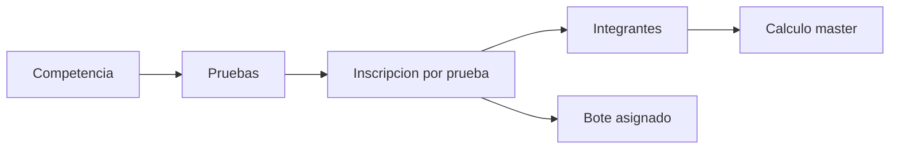
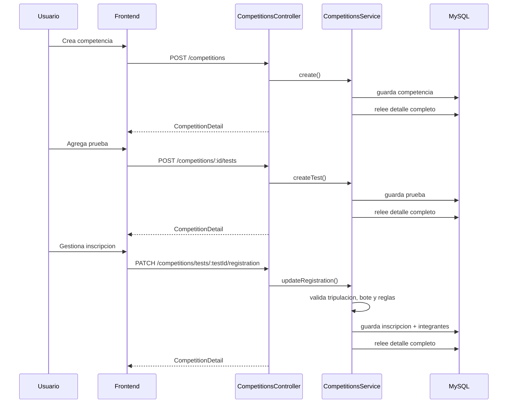
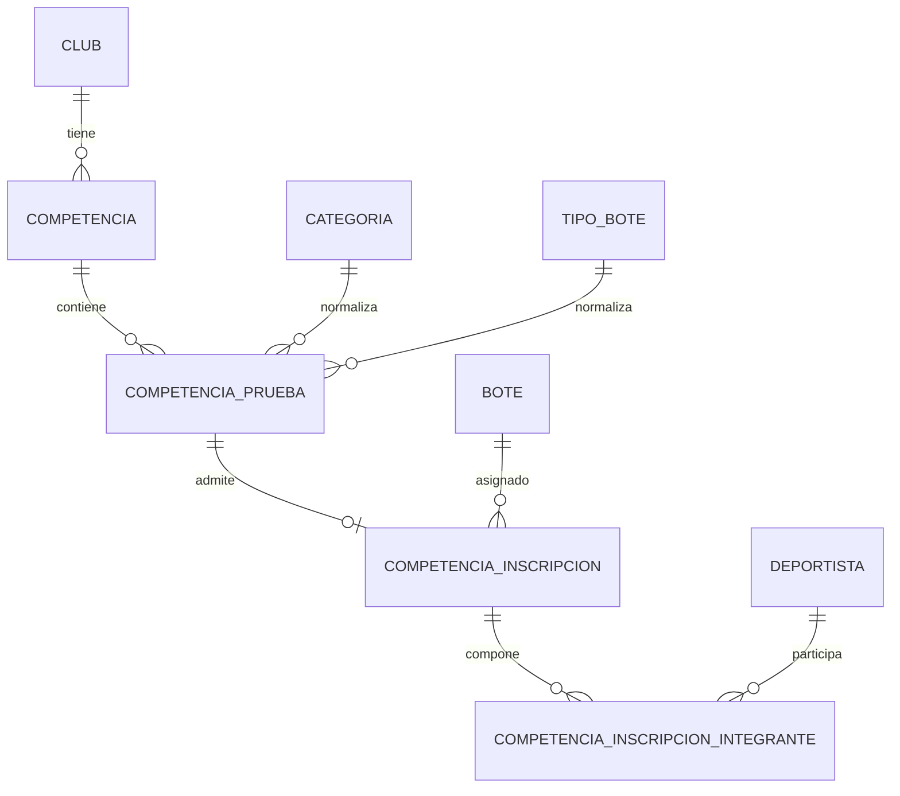
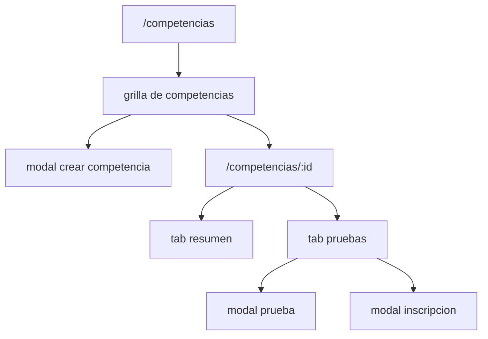

# Modulo de competencias

Este documento resume el modulo de `competencias` para que puedas explicarlo con solvencia tecnica y funcional, sin entrar en ruido innecesario.

## Idea central

El modulo resuelve una necesidad concreta:

- registrar una competencia o regata del calendario
- definir su programa de pruebas
- armar la inscripcion del club por cada prueba
- validar reglas deportivas y operativas antes de dejar la inscripcion `nominativa`

La unidad de trabajo real no es solo la competencia. Es esta cadena:

`competencia -> prueba -> inscripcion -> integrantes`

## Mapa mental rapido



## Que hace cada capa

### Frontend

- `/competencias`: grilla de entrada del modulo.
- `/competencias/:id`: pagina de gestion de una sola competencia.
- Modales:
  - crear competencia
  - editar competencia
  - crear o editar prueba
  - gestionar inscripcion

### Backend

- expone catalogos para poblar formularios
- devuelve listado resumido
- devuelve detalle recompuesto de una competencia completa
- valida reglas de negocio antes de guardar
- recompone siempre el estado completo del agregado al responder

### Base de datos

- modela competencia, pruebas, inscripcion y tripulacion
- mantiene snapshots de los deportistas al momento de inscribir
- deja persistido el calculo master

## Flujo funcional real



## Modelo de datos

### Relacion entre entidades



### Lectura de negocio por tabla

#### `competencia`

Representa el evento macro.

- nombre
- tipo: `regata` o `ergometro`
- origen: `manual` o `importada`
- organizador
- sede
- ventana de fechas
- estado: `borrador`, `en_trabajo`, `cerrada`

#### `competencia_prueba`

Representa cada salida o prueba del programa.

- numero y orden
- nombre visible
- categoria normalizada por `id_categoria`
- snapshot operativo de categoria en `categoria_origen`
- metadatos de origen: genero, modalidad, tipo de bote original
- tipo de bote normalizado opcional
- distancia, fecha, hora
- reglas operativas:
  - `requiere_bote`
  - `cantidad_tripulantes_esperada`
  - `requiere_timonel`
  - `es_master`
- origen del dato: `manual`, `importada`, `editada`

#### `competencia_inscripcion`

Representa la inscripcion del club para una prueba.

- hay maximo una por prueba
- puede tener bote o no
- estado: `presuntiva`, `nominativa`
- calculos master:
  - `promedio_edad`
  - `categoria_master_estimada`

#### `competencia_inscripcion_integrante`

Representa la tripulacion concreta.

- un deportista por fila
- `orden` dentro de la tripulacion
- `es_timonel`
- `rol_texto`
- snapshots:
  - nombre
  - rut
  - fecha de nacimiento
- calculos:
  - edad en la competencia
  - categoria master individual

## Por que existen snapshots

El modulo no guarda solo referencias a `deportista`.
Tambien guarda una foto historica del integrante al momento de la inscripcion.

Eso protege trazabilidad si despues cambian:

- nombre del usuario
- RUT
- fecha de nacimiento
- categoria deportiva actual

## Reglas de integridad importantes

### Competencia

- no se puede crear sin nombre
- no se puede crear sin tipo
- no se puede crear sin fecha inicio y fecha fin
- fecha fin no puede ser menor a fecha inicio

### Prueba

- debe tener `numeroPrueba`, `ordenPrueba` y `nombrePrueba`
- la categoria se guarda normalizada por `idCategoria`
- si se normaliza con `idTipoBote`, el backend deriva:
  - cantidad esperada de tripulantes
  - si requiere timonel
- si la competencia es `ergometro`, la prueba no puede requerir bote

### Inscripcion

- una inscripcion `nominativa` debe tener integrantes
- si la prueba requiere timonel, debe existir uno
- si la prueba no requiere timonel, no puede marcarse uno
- si la inscripcion queda `nominativa` y la prueba exige dotacion fija, la cantidad debe coincidir
- si la inscripcion queda `nominativa` y la prueba requiere bote, debe tener bote asignado
- los deportistas deben pertenecer a la categoria vigente de la prueba
- no se puede repetir el mismo deportista
- no se puede repetir el mismo `orden`

### Compatibilidad del bote

Si la prueba tiene `idTipoBote` normalizado:

- el bote debe existir
- debe estar activo
- su estado debe permitir uso
- su tipo debe coincidir con la prueba

## Regla especial de ergometro

Si una competencia cambia a tipo `ergometro`, el backend ajusta las pruebas existentes:

- `requiereBote = false`
- `idTipoBote = null`
- `requiereTimonel = false`

Eso evita inconsistencias entre el tipo global de competencia y las reglas de sus pruebas.

## Calculo master

El calculo master ocurre al guardar la inscripcion.

### Nivel integrante

- se calcula `edadCompetencia` usando el anio de `fechaInicio` de la competencia
- si la prueba es master, se deriva `categoriaMasterIndividual`

### Nivel inscripcion

- si la prueba es master y hay integrantes:
  - se calcula promedio de edad
  - se estima categoria master global

Rango implementado:

- A: 27-35
- B: 36-42
- C: 43-49
- D: 50-54
- E: 55-59
- F: 60-64
- G: 65-69
- H: 70-74
- I: 75-79
- J: 80+

## Contrato API

### Endpoints

- `GET /competitions/catalogs`
- `GET /competitions`
- `GET /competitions/:id`
- `POST /competitions`
- `PATCH /competitions/:id`
- `POST /competitions/:id/tests`
- `PATCH /competitions/tests/:testId`
- `PATCH /competitions/tests/:testId/registration`

### Rol real de cada endpoint

- `catalogs`: devuelve club, estados, tipos de bote, botes utilizables y deportistas activos
- `findAll`: devuelve resumen para la grilla
- `findOne`: devuelve el agregado completo para la pantalla de gestion
- `create/update`: operan sobre cabecera de competencia
- `createTest/updateTest`: operan sobre el programa
- `updateRegistration`: opera sobre la inscripcion del club

## Respuesta de detalle

El frontend trabaja casi siempre con `CompetitionDetail`, porque ese objeto trae:

- cabecera de competencia
- resumen agregado
- lista ordenada de pruebas
- cada prueba con su inscripcion embebida
- cada inscripcion con integrantes, bote y calculos master

Conclusion practica:

- el frontend no recompone joins complejos
- el backend devuelve el agregado listo para pintar

## Arquitectura frontend



### Pantalla `/competencias`

Es la puerta de entrada.

- consulta catalogos y listado
- muestra tabla resumida
- permite crear competencia
- al crear, navega directo a la pagina de gestion

### Pantalla `/competencias/:id`

Es la zona de trabajo.

- carga catalogos
- carga detalle de la competencia
- muestra KPIs y contexto
- tiene dos tabs:
  - `resumen`
  - `pruebas`

### Modal de inscripcion

Es el punto mas rico del modulo.

- edita estado
- asigna bote
- solo lista botes compatibles con el tipo de prueba
- permite buscar deportistas activos de la categoria vigente de la prueba
- excluye del buscador a quienes ya fueron agregados
- deja ajustar orden, rol y timonel
- al guardar, todo vuelve a sincronizarse desde backend

## Ejemplos minimos

### Crear competencia

```json
{
  "nombre": "Regata Apertura 2026",
  "tipoCompetencia": "regata",
  "organizador": "Asociacion Regional",
  "sede": "Laguna Chica",
  "fechaInicio": "2026-05-10",
  "fechaFin": "2026-05-11",
  "estado": "borrador"
}
```

### Crear prueba

```json
{
  "numeroPrueba": 4,
  "ordenPrueba": 4,
  "nombrePrueba": "4x femenino juvenil",
  "idCategoria": 6,
  "idTipoBote": 5,
  "distancia": 1000,
  "fecha": "2026-05-10",
  "hora": "10:30",
  "esMaster": false
}
```

### Guardar inscripcion

```json
{
  "estado": "nominativa",
  "idBote": 12,
  "integrantes": [
    { "idDeportista": 31, "orden": 1, "esTimonel": false },
    { "idDeportista": 44, "orden": 2, "esTimonel": false },
    { "idDeportista": 52, "orden": 3, "esTimonel": false },
    { "idDeportista": 61, "orden": 4, "esTimonel": false }
  ]
}
```

## Como explicarlo a terceros en 60 segundos

Puedes decirlo asi:

> El modulo de competencias modela el trabajo real del club en capas. Primero registramos el evento, luego su programa de pruebas, y finalmente la inscripcion del club para cada prueba. El backend devuelve siempre el agregado completo y valida reglas deportivas como dotacion, timonel, compatibilidad de bote, categoria del deportista y calculo master. En base de datos la clave es que la prueba normaliza categoria y tipo de bote, mientras la inscripcion guarda snapshots de los integrantes para mantener trazabilidad historica.

## Si tienes que auditarlo rapido

Revisa en este orden:

1. `competencia.entity.ts`
2. `competencia-prueba.entity.ts`
3. `competencia-inscripcion.entity.ts`
4. `competencia-inscripcion-integrante.entity.ts`
5. `competitions.service.ts`
6. `frontend/src/pages/CompetitionsPage.tsx`
7. `frontend/src/pages/CompetitionManagementPage.tsx`

## Puntos fuertes del diseño actual

- agregado bien definido
- backend dueño de las reglas
- frontend simple de consumir
- trazabilidad historica por snapshots
- soporte real para regata y ergometro
- posibilidad futura de importar pruebas sin romper el modelo

## Limites actuales

- no hay eliminacion explicita de competencia o prueba
- no hay workflow formal de aprobacion
- no existe versionado de importaciones
- no hay validacion de disponibilidad de bote por cruce horario entre pruebas
- no hay control de permisos por rol a nivel de endpoint

## Idea final

Este modulo no es solo una tabla de competencias.
Es un agregado deportivo-operativo pensado para pasar de calendario a tripulacion nominativa, con reglas de negocio embebidas en backend y una UI enfocada en trabajar una competencia a la vez.
