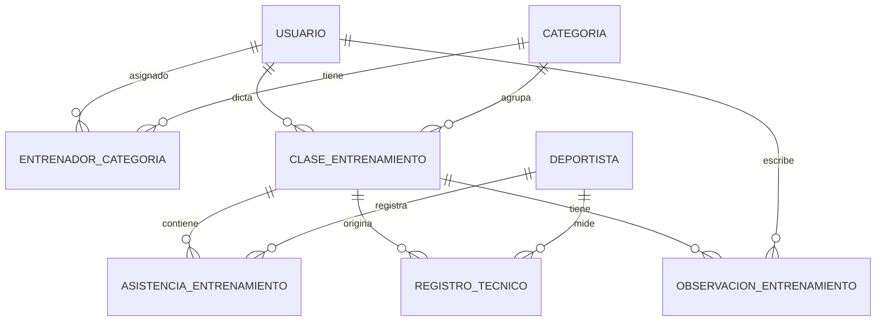
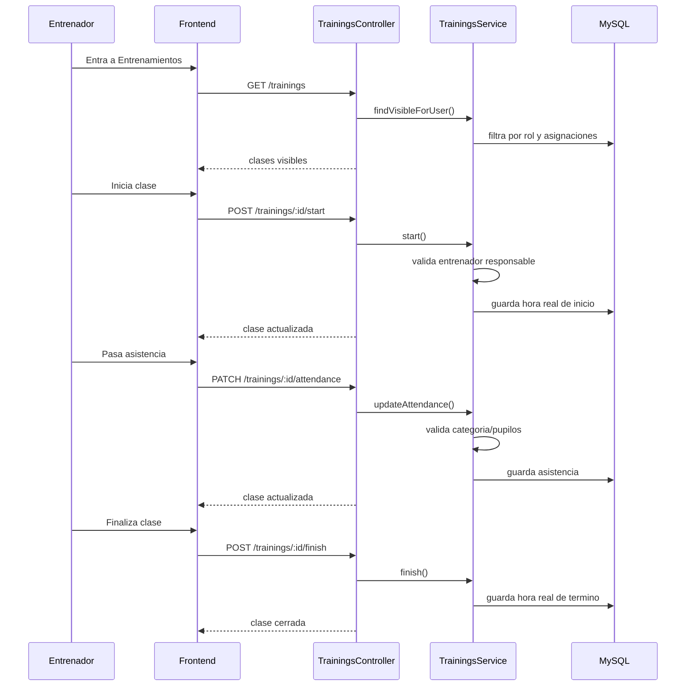

# Modulo de entrenadores

Este documento describe una propuesta funcional para desarrollar un item de menu o modulo orientado al trabajo de entrenadores, control tecnico y supervision deportiva.

El objetivo es dejar una base para revisar, definir y modificar antes de implementar.

## Estado de esta propuesta

- Estado: propuesta funcional inicial.
- No representa todavia una implementacion existente.
- Debe ajustarse al funcionamiento actual del sistema.
- Debe evitar una navegacion con muchos submenus.
- Por ahora los deportistas no tendran acceso a ver sus metricas desde este modulo.

## Idea central

El modulo debe permitir que los entrenadores registren el trabajo diario realizado con sus categorias o pupilos, y que perfiles autorizados puedan supervisar esa informacion.

La unidad de trabajo principal no debe ser solo el entrenador. La cadena funcional sugerida es:

`entrenador -> categoria/pupilos -> clase -> asistencia -> registros tecnicos -> supervision`

## Criterios importantes

### No dar acceso a deportistas por ahora

Aunque el modulo registre metricas de deportistas, los deportistas no deben tener acceso a verlas en esta etapa.

Esto implica:

- no crear vista de metricas para deportistas
- no agregar item de menu para deportistas
- no mostrar historial tecnico al deportista desde su sesion
- no exponer endpoints pensados para autoconsulta del deportista

La informacion puede quedar registrada para uso interno del club, entrenadores, head coach, directiva o administradores.

### No llenar el sistema con submenus

El modulo debe seguir el funcionamiento actual del sistema, donde los items principales del menu llevan a pantallas de trabajo.

La recomendacion es crear un solo item de menu:

- Menu: `Entrenamientos` o `Gestion deportiva`
- Ruta sugerida: `/entrenamientos`
- Pantalla unica de entrada con filtros, tabs o secciones internas

No se recomienda crear submenus separados para:

- asistencia
- eventos
- observaciones
- reportes
- pupilos

Esos elementos deberian vivir dentro de la misma pantalla o flujo, usando tabs, paneles, filtros, modales o detalle.

## Nombre sugerido del modulo

Opciones:

- `Entrenamientos`
- `Gestion deportiva`
- `Control tecnico`
- `Modulo entrenadores`

Recomendacion inicial:

`Entrenamientos`

Es mas directo, corto y consistente con un item de menu operativo. Si en el futuro el modulo crece mucho hacia analisis, evaluaciones y reportes, podria evolucionar a `Gestion deportiva`.

## Usuarios y roles

### Roles base actuales relacionados

El sistema ya contiene roles como:

- `admin`
- `presidente`
- `vicepresidente`
- `secretario`
- `tesorero`
- `director`
- `deportista`
- `entrenador`

### Rol nuevo sugerido

Se recomienda evaluar un nuevo rol:

- `head_coach`

Este rol serviria para supervisar el trabajo de entrenadores sin depender necesariamente de roles de directiva.

### Regla general

No basta con que un usuario vea el item de menu. Tambien debe existir control de acciones dentro del modulo.

Ejemplo:

- un entrenador puede registrar sus clases
- un head coach puede revisar clases de todos los entrenadores
- directiva puede ver informacion consolidada
- admin puede configurar y corregir

## Visibilidad del item de menu

El item de menu deberia estar disponible para:

- `admin`
- `entrenador`
- `head_coach`, si se crea
- roles de directiva que se definan como autorizados

Roles de directiva posibles:

- `presidente`
- `vicepresidente`
- `director`

Pendiente por definir:

- si `secretario` y `tesorero` deben ver este modulo
- si directiva tendra solo lectura o alguna capacidad de observacion
- si `head_coach` reemplaza parte de la visibilidad de directiva

## Matriz funcional inicial

| Rol | Ver menu | Registrar clase | Pasar asistencia | Crear registros tecnicos | Ver todo | Supervisar | Configurar |
|---|---:|---:|---:|---:|---:|---:|---:|
| `entrenador` | Si | Si | Si | Si, en sus categorias | No | No | No |
| `head_coach` | Si | Opcional | Opcional | Si | Si | Si | No |
| `director` | Si | No | No | No | Si | Opcional | No |
| `presidente` | Si | No | No | No | Si | Opcional | No |
| `admin` | Si | Si | Si | Si | Si | Si | Si |
| `deportista` | No | No | No | No | No | No | No |

## Permisos sugeridos

Para no depender solo del nombre del rol, se recomienda pensar en permisos funcionales.

Permisos posibles:

- `trainings.view_menu`
- `trainings.view_own`
- `trainings.view_all`
- `trainings.sessions.create`
- `trainings.sessions.start`
- `trainings.sessions.finish`
- `trainings.attendance.update`
- `trainings.records.create`
- `trainings.records.update_own`
- `trainings.records.update_all`
- `trainings.supervision.comment`
- `trainings.reports.view`
- `trainings.config.manage`

En una primera version se puede mapear estos permisos por rol, aunque el sistema todavia no tenga una capa formal completa de autorizacion por permiso.

## Pantalla unica propuesta

La pantalla `/entrenamientos` deberia adaptarse segun el rol del usuario.

### Vista entrenador

Objetivo: trabajo rapido y operativo.

Elementos sugeridos:

- clases de hoy o ultimas clases
- boton para crear clase
- boton para iniciar clase
- boton para finalizar clase
- control de asistencia
- registros tecnicos asociados a la clase o deportistas
- observaciones
- historial propio filtrable

### Vista head coach o directiva

Objetivo: supervision y control.

Elementos sugeridos:

- filtro por entrenador
- filtro por categoria
- filtro por rango de fechas
- resumen de clases realizadas
- resumen de asistencia
- registros tecnicos recientes
- clases abiertas o sin cerrar
- observaciones relevantes
- detalle de una clase
- comentarios de supervision

### Vista admin

Objetivo: administracion y correccion.

Elementos sugeridos:

- todo lo anterior
- asignar entrenadores a categorias
- corregir registros cuando sea necesario
- reabrir clases cerradas
- administrar catalogos basicos del modulo

## Clases

Una clase representa una actividad realizada o planificada por un entrenador.

Datos sugeridos:

- entrenador responsable
- categoria o grupo
- fecha
- hora planificada de inicio
- hora planificada de termino
- hora real de inicio
- hora real de termino
- lugar
- tipo de entrenamiento
- objetivo de la clase
- estado
- observacion general

Estados sugeridos:

- `programada`
- `iniciada`
- `finalizada`
- `cerrada`
- `anulada`

## Inicio y fin de clase

Se recomienda incluir inicio y fin de clase.

Sirve para:

- confirmar que la clase se realizo
- registrar duracion real
- detectar clases abiertas
- revisar cumplimiento de trabajo
- dar trazabilidad a la supervision

Reglas sugeridas:

- el entrenador puede iniciar una clase propia
- el entrenador puede finalizar una clase propia
- una clase finalizada puede quedar bloqueada despues de cierto plazo
- si una clase queda abierta, se debe permitir cierre posterior con motivo
- admin o head coach puede reabrir o corregir segun definicion

## Asistencia

La asistencia debe registrarse por clase y deportista.

Estados sugeridos:

- `presente`
- `ausente`
- `ausente_justificado`
- `atrasado`
- `lesionado`
- `retiro_anticipado`

Datos sugeridos por asistencia:

- deportista
- estado
- hora o marca opcional
- observacion individual

Reglas sugeridas:

- el entrenador solo puede pasar asistencia de deportistas de sus categorias o pupilos asignados
- head coach puede revisar todo
- directiva puede ver asistencia consolidada si tiene permiso
- deportistas no pueden ver su asistencia desde este modulo por ahora

## Categorias y pupilos

Debe existir una forma de relacionar entrenadores con:

- categorias completas
- deportistas especificos, si corresponde

Ejemplos:

- un entrenador puede tener una categoria completa asignada
- varios entrenadores pueden compartir una categoria
- un deportista puede tener un entrenador principal
- un deportista puede tener entrenadores secundarios

Pendiente por definir:

- si la asignacion sera solo por categoria
- si tambien existira asignacion individual por deportista
- si se permitira mas de un entrenador responsable por clase

## Registros tecnicos y eventos

El modulo debe permitir registrar eventos o mediciones deportivas.

Tipos iniciales sugeridos:

- test de ergometro
- test en agua
- peso maximo o marca de fuerza
- control de peso corporal
- evaluacion tecnica
- evaluacion de asistencia o compromiso
- resultado de control interno
- observacion de lesion o molestia
- registro libre

Cada registro tecnico deberia permitir:

- tipo de registro
- fecha
- categoria
- entrenador que registra
- deportista o grupo asociado
- valor principal
- unidad de medida
- detalle adicional
- observacion

Ejemplos:

- 2.000 metros ergometro: tiempo final, split promedio, watts
- test en agua: distancia, tiempo, embarcacion, condiciones
- fuerza: ejercicio, peso maximo, repeticiones
- tecnica: item evaluado, nivel, comentario

## Observaciones

Se recomienda separar las observaciones por contexto.

Tipos sugeridos:

- observacion de clase
- observacion individual de deportista
- observacion tecnica
- observacion de supervision
- observacion administrativa

Regla importante:

No todas las observaciones deberian ser visibles para todos. Algunas pueden ser solo internas para entrenador/head coach/admin.

## Supervision

El objetivo de la supervision no es alterar el registro original, sino revisar y dejar trazabilidad.

Acciones posibles:

- comentar una clase
- marcar clase como revisada
- solicitar correccion
- reabrir una clase cerrada
- agregar observacion de supervision

Se recomienda que directiva tenga preferentemente lectura y comentarios, mientras que head coach o admin tengan capacidad de correccion mas amplia.

## Reportes dentro de la misma pantalla

Para no crear submenus, los reportes pueden aparecer como una seccion o tab dentro de `/entrenamientos`.

Reportes iniciales sugeridos:

- clases realizadas por entrenador
- asistencia por categoria
- asistencia por deportista
- clases sin finalizar
- registros tecnicos por categoria
- evolucion de tests por deportista
- observaciones recientes

En MVP, estos reportes pueden ser resumenes simples y filtros, no necesariamente graficos avanzados.

## Modelo de datos conceptual

## Entidades sugeridas

### `entrenador_categoria`

Relaciona entrenadores con categorias.

- id entrenador usuario
- id categoria
- fecha inicio
- fecha termino opcional
- activo

### `clase_entrenamiento`

Representa la clase planificada o realizada.

- id entrenador usuario
- id categoria
- fecha
- hora inicio planificada
- hora termino planificada
- hora inicio real
- hora termino real
- lugar
- tipo entrenamiento
- objetivo
- estado
- observacion general

### `asistencia_entrenamiento`

Representa la asistencia por deportista.

- id clase
- id deportista
- estado asistencia
- observacion

### `registro_tecnico`

Representa una medicion, test o evento deportivo.

- id clase opcional
- id entrenador usuario
- id deportista opcional
- id categoria opcional
- tipo registro
- fecha
- valor principal
- unidad
- detalle
- observacion

### `observacion_entrenamiento`

Representa comentarios asociados a clase, deportista o supervision.

- id clase opcional
- id deportista opcional
- id usuario autor
- tipo observacion
- texto
- visibilidad

## Contrato funcional sugerido

Endpoints posibles para una primera version:

- `GET /trainings/catalogs`
- `GET /trainings`
- `GET /trainings/:id`
- `POST /trainings`
- `PATCH /trainings/:id`
- `POST /trainings/:id/start`
- `POST /trainings/:id/finish`
- `PATCH /trainings/:id/attendance`
- `POST /trainings/:id/records`
- `POST /trainings/:id/observations`
- `GET /trainings/summary`

La implementacion puede adaptar nombres a convenciones finales del proyecto.

## Flujo funcional sugerido

## MVP recomendado

Primera version sugerida:

1. Un solo item de menu: `Entrenamientos`.
2. Ruta unica: `/entrenamientos`.
3. Vista adaptada por rol.
4. Asignacion de entrenadores a categorias.
5. Crear, iniciar y finalizar clases.
6. Pasar asistencia.
7. Registrar observaciones generales e individuales.
8. Registrar eventos tecnicos simples.
9. Vista de supervision para head coach, directiva o admin.
10. Sin acceso para deportistas a sus metricas.

## Fuera de alcance inicial

Para mantener el modulo controlado, se deja fuera del MVP:

- portal de metricas para deportistas
- graficos avanzados
- notificaciones automaticas
- aprobacion mensual formal
- planificacion deportiva completa por microciclos
- carga de archivos adjuntos
- integracion con competencias
- integracion avanzada con botes o disponibilidad de flota

## Decisiones pendientes

- Nombre final del item de menu.
- Crear o no el rol `head_coach`.
- Que roles de directiva podran ver el modulo.
- Si directiva podra comentar o solo revisar.
- Si la asignacion de entrenadores sera por categoria, por deportista o ambas.
- Si una clase puede tener mas de un entrenador.
- Plazo despues del cual una clase finalizada queda bloqueada.
- Tipos iniciales de registros tecnicos.
- Nivel de detalle requerido para test de ergometro y test en agua.

## Recomendacion final

La mejor primera version es una pantalla unica y operativa para entrenadores, con una vista de supervision para roles autorizados.

El foco debe estar en:

- registrar clases
- pasar asistencia
- guardar observaciones
- registrar mediciones tecnicas basicas
- permitir supervision
- mantener a deportistas fuera de la visualizacion por ahora

Esto permite avanzar sin convertir el modulo en una estructura pesada, y deja una base clara para crecer hacia reportes, planificacion deportiva y fichas tecnicas mas adelante.
